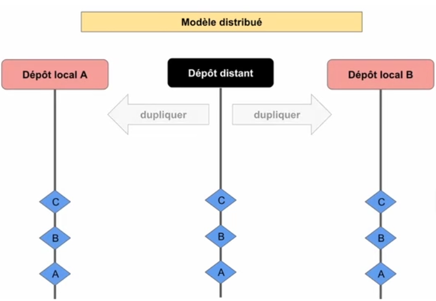

# II. GIT 

### 1. Dissier de travail - c'est le dossier dans lequel il faut être (avec le terminal) pour travailler avec git
### 2. Zone d'index - c'est "l'endroit"( un genre de sac) où on met/indexe toutes les modifications à l'aide de commande "git add" aussi on peut retirer/desindexer certaines modifications qui y sont. Une fois on a le resultat souhaité on peut faire le "commit"
### 3. Notre commit - l'ensemble des modifications va passer dans le dépôt local sous forme d'un commit 

------
-----
## Commandes clés 
	git config --global user.name "..." 		git init -> initialisation d'un projet git
	git config --global user.email "..."  		git status
							                    git add ou reset <nom du fichier> ou .
                                                git commit -m "nom du  commit"
                                                git log
----------
-------							
## installation sur linux
    sudo apt install git-all (-all en option)
## installation sur mac os
### - on verifie s'il y est avec le terminal
### s'il n'y est pas - l'ordi va nous proposer l'installation sinon on peut aller sur le site git-scm.com/download/mac
## installation sur windows
### - on va sur le site et on telecharge et on installe 
--------

## Configuration  

### rensegner le nom et adresse mail
    git config --global user.name "... ..."
    git config --global user.email "..." (il faut mettre le même mail qui dans le github)
### pour verifier qui est l'utilisateur
    git config --global --list
### si on tappe juste git dans le terminl ça nous sortira les commandes utilisable
------------------------
### On peut passer à l'initialisation, avec "cd" on se met dans le dossier avec un projet puis on tappe 
    git init -> initialisation d'un projet git
### Maitenant on peut faire 
    git status -> ça nous permet voir le status de projet et si les fichiers sont bien suivis
### Pour faire suivre les fichier par le git on fait 
    git add <nom du fichier> ou . pour indexer/ajouter tout 
    git reset <nom du fichier> -> permet desindexer le fichier
### Pour transferer le travail dans le repertoire de github on cree le repertoire sur github et on recupere les commandes proposé. Une fois fait - simple commande "git push" permet transferer les modifications sur le github

### Visualiser les modifications 
    git diff 
    -> il faut faire ça avant le "git add" car cette commande permet visualiser les modifs qui ne sons pas encore passé dans la zone d'index; sinon on fait 
    git diff --cached
------------------------
## On peut passer au commit 
- Un commit possède 
-> un identifiant unique de 40 caractères 'SHA-1'
-> un esnemble de modifications 
-> commentaire décrivant le commit
-> les informations sur l'auteur (nom et email)
-> une date de création
-> liste (sha-1) de son ou ses parents

### Commit prend toutes les modifications et les enregistres "sous forme d'un packet" et ce commit lui meme est enregistré dans notre dépôt local ainsi quand on regarde l'historique on a plusieurs commit affiché avec le informations
    git commit -m "premier commit"
-------

### L'historique d'un dépôt git constitué d'un ensemble  des commits relié entre eux par un pointeur (cet ensemble est une branche) 
### pour afficher l'historique 
    git log
### pour afficher le contenu d'un commit 
    git show <SHA-1>

### si on veut revenir dans la version précédante du projet                        
    git checkout <SHA-1>                                                            
### pour revenir a la dernière version du projet                                   
    git checkout main/master (sur "mint" main; éventuellement sur windows master)   
--------------------------------
## Utilisation des tags
### pour assigner un tag on devrait se placer au niveau du commit desiré avec la commande 
    git checkout sha-1
    git tag <nom du tag> 
    ou
    git tag <nom du tag> -m"note"
    *git tag -> affiche tous les tags
### ensuite on peut verifier avec "git log". 
### Pour suprimer le tag 
    git tag --delete <nom du tag> -> ainsi on verra sha-1 à la place du tag

---------
---------
## Créer et configurer un dépôt git sous github
### D'abord sur le github, on va creer un "repositry" ensuite githu va nous proposer des commandes 
    git remote add origin ..........
    git push -u origin master/main

## Travailler avec dépôt distant
 

### 1. Sur la page d'accueil de github il faut aller dans le projet qu'on veut cloner, on tape sur ongle "code" (on peut passer par https ou ssh) une fois choisi la methode on copie le chemin proposé à côté
    git config user.name -> ça nous permet voir avec quel débot on a fait des modifs
### 2. On se place dans le dossier parent du dossier de projet et on ouvre le terminal et on tape 
    git clone <chemin du repository> <nom du dossier> ->si le nom n'est pas indique le nom sera le meme que celui de repository* 
### 3. On se deplace avec le terminal dans le dossier cloné, et on recupere ce qu'il y a dans le dépôt distant 
    git fetch -> pour récupérer les infos du dépôt distant 
    ou
    git pull -> on applique ces modifs à notre dossier 

## Creation de la clé ssh 
    ssh-keygen -t ed25519 -C "your_email@example.com"
### *vieille machine - ssh-keygen -t ecdsa-sk -C "your_email@example.com"
### on accede au dossier avec la cle puis avec nano on ouvre le fichier et on copie la cle
    cd ~/.ssh
    nano <nom de la clé>.pub
### Une fois la clé récupéré, on va sur le site git dans les settings on tape sur l'ongle ssh et ensuite ajouter une clé ssh et colle la clé. 
### Github nous donnes les commandes de *connexion -> on les entre dans le terminal (il faut bien choisir la clé ssh sinon on aura l'erreur d'autentification) 

### Maintenant on peut tester la connexion 
    ssh -T git@github.com

