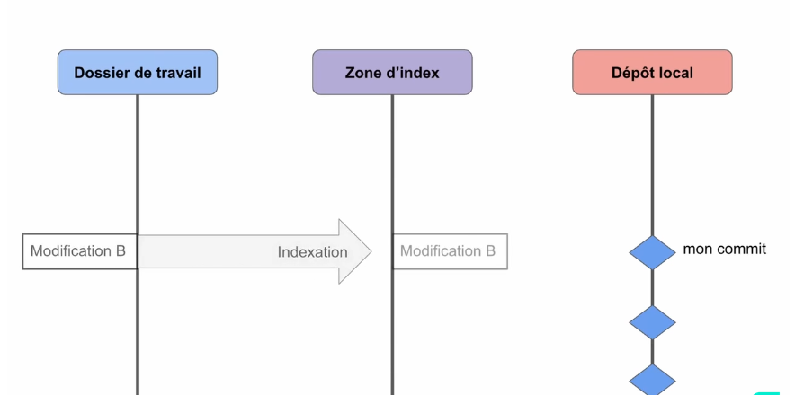

# I. WSL
#### Le Sous-système Windows pour Linux (WSL) permet aux développeurs d’installer une distribution Linux (comme Ubuntu, OpenSUSE, Kali, Debian, Arch Linux, etc.) et d’utiliser des applications, des utilitaires et des outils en ligne de commande Bash Linux directement sur Windows, sans modification, sans devoir passer par une machine virtuelle traditionnelle ou une configuration à double démarrage.
### Installer la commande WSL 
### PowerShell ->  wsl --install
#### Cette commande active les fonctionnalités nécessaires pour exécuter WSL et installer la distribution Ubuntu de Linux. (Cette distribution par défaut peut être changée).
- il faut redemarrer la machine 
### Modifier la distribution Linux par défaut installée
#### Par défaut, la distribution Linux installée sera Ubuntu. Elle peut être modifiée à l’aide de l’indicateur -d.
- Pour changer la distribution installée, entrez : wsl --install -d <Distribution Name>. Remplacez <Distribution Name> par le nom de la distribution que vous souhaitez installer.
- Pour afficher la liste des distributions Linux disponibles en téléchargement par le biais du magasin en ligne, entrez : wsl --list --online ou wsl -l -o.
- Pour installer des distributions Linux supplémentaires après l’installation initiale, vous pouvez également utiliser la commande : wsl --install -d <Distribution Name>.
### S'on tombe sur l'erreur vertualisation:
#### il faut soit passer dans le bios ou dans la barre de recherceh(windows) on cherhcer hyper-v et on l'active - si ça ne fonctionne pas il faut aller dans le bios (https://www.bleepingcomputer.com/tutorials/how-to-enable-cpu-virtualization-in-your-computer-bios/) 
- il faut redemarrer la machine ensuite pour que ça fonctionne
------------------------------------------------------------------------------------------------
-----
# II. GIT 

### 1. Dissier de travail - c'est le dossier dans lequel il faut être (avec le terminal) pour travailler avec git
### 2. Zone d'index - c'est "l'endroit"( un genre de sac) où on met/indexe toutes les modifications à l'aide de commande "git add" aussi on peut retirer/desindexer certaines modifications qui y sont. Une fois on a le resultat souhaité on peut faire le "commit"
### 3. Notre commit - l'ensemble des modifications va passer dans le dépôt local sous forme d'un commit 

------
-----
## Commandes clés 
	git config --global user.name "..." 		git init -> initialisation d'un projet git
	git config --global user.email "..."  		git status
							                    git add ou reset <nom du fichier> ou .
                                                git commit -m "nom du  commit"
                                                git log
----------
-------							
## installation sur linux
    sudo apt install git-all (-all en option)
## installation sur mac os
### - on verifie s'il y est avec le terminal
### s'il n'y est pas - l'ordi va nous proposer l'installation sinon on peut aller sur le site git-scm.com/download/mac
## installation sur windows
### - on va sur le site et on telecharge et on installe 
--------

## Configuration  

### rensegner le nom et adresse mail
    git config --global user.name "... ..."
    git config --global user.email "..." (il faut mettre le même mail qui dans le github)
### pour verifier qui est l'utilisateur
    git config --global --list
### si on tappe juste git dans le terminl ça nous sortira les commandes utilisable
------------------------
### On peut passer à l'initialisation, avec "cd" on se met dans le dossier avec un projet puis on tappe 
    git init -> initialisation d'un projet git
### Maitenant on peut faire 
    git status -> ça nous permet voir le status de projet et si les fichiers sont bien suivis
### Pour faire suivre les fichier par le git on fait 
    git add <nom du fichier> ou . pour indexer/ajouter tout 
    git reset <nom du fichier> -> permet desindexer le fichier

### Visualiser les modifications 
    git diff 
    -> il faut faire ça avant le "git add" car cette commande permet visualiser les modifs qui ne sons pas encore passé dans la zone d'index; sinon on fait 
    git diff --cached
------------------------
## On peut passer au commit 
- Un commit possède 
-> un identifiant unique de 40 caractères 'SHA-1'
-> un esnemble de modifications 
-> commentaire décrivant le commit
-> les informations sur l'auteur (nom et email)
-> une date de création
-> liste (sha-1) de son ou ses parents

### Commit prend toutes les modifications et les enregistres "sous forme d'un packet" et ce commit lui meme est enregistré dans notre dépôt local ainsi quand on regarde l'historique on a plusieurs commit affiché avec le informations
    git commit -m "premier commit"
-------

### L'historique d'un dépôt git constitué d'un ensemble  des commits relié entre eux par un pointeur (cet ensemble est une branche) 
### pour afficher l'historique 
    git log
### pour afficher le contenu d'un commit 
    git show <SHA-1>

### si on veut revenir dans la version précédante du projet                        
    git checkout <SHA-1>                                                            
### pour revenir a la dernière version du projet                                   
    git checkout main/master (sur "mint" main; éventuellement sur windows master)   
--------------------------------
## Utilisation des tags
### pour assigner un tag on devrait se placer au niveau du commit desiré avec la commande 
    git checkout sha-1
    git tag <nom du tag> 
    ou
    git tag <nom du tag> -m"note"
    *git tag -> affiche tous les tags
### ensuite on peut verifier avec "git log". 
### Pour suprimer le tag 
    git tag --delete <nom du tag> -> ainsi on verra sha-1 à la place du tag

### commande de creation de la clé 
## ssh-keygen -t ed25519 -C "your_email@example.com"
### vieille machine - ssh-keygen -t ecdsa-sk -C "your_email@example.com"
### on accede au dossier avec la cle puis avec nano on ouvre le fichier et on copie la cle 
## cd /.ssh

### commande de test de connexion 
## ssh -T git@github.com
### git init -> initialisation d'un projet git 

